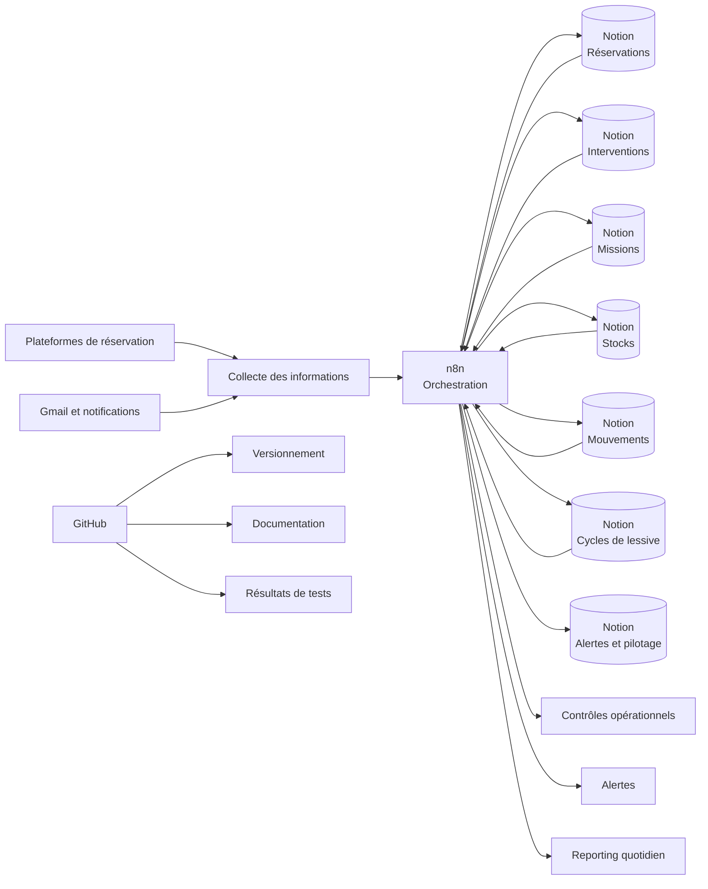

# KONOS SUITES — Operations Automation

> Système d’automatisation des opérations d’une location saisonnière, construit avec **n8n**, **Notion** et **GitHub**.


---

## Présentation

Ce projet automatise les principales opérations liées à la gestion de **KONOS SUITES**, un appartement exploité en location saisonnière au Puy-en-Velay.

L’objectif est de transformer une gestion initialement manuelle et dispersée en un système :

- centralisé ;
- traçable ;
- reproductible ;
- résilient ;
- documenté ;
- progressivement automatisé.

Le système couvre le cycle opérationnel complet, depuis la validation d’une réservation jusqu’au suivi du linge, des consommables, des interventions, des incidents et des alertes avant l’arrivée du voyageur.

---

## Problématique métier

La gestion d’une location saisonnière implique plusieurs opérations interdépendantes :

- récupération et validation des réservations ;
- préparation du logement ;
- organisation des interventions ;
- affectation des missions à l’intervenante ;
- réservation du linge ;
- réservation des consommables ;
- suivi des stocks ;
- traitement des départs ;
- suivi des cycles de lessive ;
- gestion des annulations et no-show ;
- recalcul des besoins après modification ;
- détection des anomalies avant arrivée ;
- gestion des incidents ;
- pilotage quotidien.

Sans automatisation, ces tâches peuvent entraîner :

- des oublis ;
- des doubles traitements ;
- des incohérences de stock ;
- des interventions non préparées ;
- des alertes tardives ;
- une faible traçabilité ;
- une dépendance excessive aux contrôles manuels.

---

## Objectifs du projet

Le projet vise à :

1. centraliser les données opérationnelles dans Notion ;
2. orchestrer les traitements avec n8n ;
3. automatiser les opérations répétitives ;
4. prévenir les doublons ;
5. distinguer les mouvements prévisionnels des mouvements réels ;
6. contrôler l’état de préparation avant chaque arrivée ;
7. faciliter la reprise manuelle en cas d’erreur ;
8. documenter chaque workflow et chaque scénario de test ;
9. versionner le système dans GitHub ;
10. construire une base évolutive pour plusieurs logements.

---

## Architecture générale



### Responsabilité des composants

| Composant | Rôle |
|---|---|
| **n8n** | Orchestration, logique métier, appels API et automatisation |
| **Notion** | Référentiel opérationnel et interface de gestion |
| **GitHub** | Versionnement, sauvegarde, documentation et portfolio |
| **Gmail / plateformes** | Sources de données et notifications |
| **PowerShell / Git** | Organisation locale et gestion du dépôt |

---

## Périmètre fonctionnel

Le système couvre six domaines principaux.

### 1. Réservations

- création des interventions internes ;
- gestion des annulations ;
- gestion des no-show ;
- recalcul des besoins après modification.

### 2. Opérations

- synchronisation des interventions ;
- création des missions intervenante ;
- suivi des interventions ;
- contrôle avant arrivée.

### 3. Stocks

- réservation prévisionnelle du linge ;
- réservation prévisionnelle des consommables ;
- détection des stocks insuffisants ;
- génération d’alertes et de listes de courses.

### 4. Linge et lessive

- retour du linge sale ;
- rattachement aux cycles de lessive ;
- mouvements de suivi ;
- retour en stock propre.

### 5. Alertes et incidents

- réservation non prête ;
- rappel à l’intervenante ;
- incident opérationnel ;
- priorisation des actions.

### 6. Pilotage

- arrivées du jour ;
- départs du jour ;
- missions ;
- anomalies ;
- alertes stock ;
- cycles de lessive ouverts ;
- résumé opérationnel quotidien.

---

## Catalogue des workflows

Le projet contient actuellement **16 workflows n8n**.

### Workflows testés et publiés

| # | Workflow | Domaine |
|---:|---|---|
| 1 | Réservation validée vers intervention interne | Réservations |
| 2 | Synchronisation des interventions vers les missions | Opérations |
| 3 | Réserver le linge depuis les interventions | Stocks |
| 4 | Réserver les consommables depuis les interventions | Stocks |
| 5 | Intervention terminée vers consommation et linge en service | Opérations |
| 6 | Départ confirmé vers retour du linge sale | Linge |
| 7 | Retours sales vers cycle de lessive | Lessive |
| 8 | Cycle de lessive vers mouvements de suivi | Lessive |
| 9 | Annulation ou no-show vers libération des stocks | Réservations |

### Workflows construits et restant à tester

| # | Workflow | Domaine |
|---:|---|---|
| 10 | Stock insuffisant vers alertes et liste de courses | Stocks |
| 11 | Modification de réservation vers recalcul des besoins | Réservations |
| 12 | Contrôle opérationnel avant arrivée | Opérations |
| 13 | Alerte réservation non prête avant arrivée | Alertes |
| 14 | Rappels et relances intervenante | Alertes |
| 15 | Gestion des incidents opérationnels | Incidents |
| 16 | Résumé quotidien et tableau de pilotage | Reporting |

Le catalogue détaillé est disponible dans :

[docs/workflows/catalog.md](docs/workflows/catalog.md)

---

## Modèle de données Notion

Les principales bases utilisées sont :

| Base | Responsabilité |
|---|---|
| Réservations | Informations commerciales et opérationnelles |
| Interventions | Préparation et remise en état du logement |
| Missions intervenante | Actions terrain affectées |
| Stock de linge | État du linge disponible |
| Stock de consommables | Quantités disponibles |
| Mouvements de linge | Traçabilité des changements d’état |
| Mouvements de consommables | Réservations et consommations |
| Cycles de lessive | Suivi du lavage et du retour en stock |
| Alertes stock | Produits à acheter ou à surveiller |
| Alertes et pilotage | Anomalies, incidents, rappels et résumés |

Documentation détaillée :

[docs/data-model/notion-data-model.md](docs/data-model/notion-data-model.md)

---

## Choix techniques

### Orchestration avec n8n

Les workflows utilisent principalement :

- **Manual Trigger** pendant les phases de test ;
- **Schedule Trigger** après validation ;
- **HTTP Request** vers l’API Notion ;
- **Code Node** pour les transformations ;
- **If** pour les décisions ;
- **Split In Batches** pour les traitements unitaires ;
- des mécanismes de recherche avant création ;
- des mises à jour conditionnelles des pages existantes.

### Appels HTTP vers Notion

Une attention particulière est portée à la configuration des corps HTTP.

#### Corps fixe

Utilisé lorsqu’aucune valeur ne dépend d’un nœud précédent :

```json
{
  "page_size": 100,
  "filter": {
    "property": "Statut",
    "select": {
      "equals": "À traiter"
    }
  }
}
```

#### Corps en expression

Utilisé lorsqu’une date, un identifiant ou une valeur dynamique doit être injecté :

```javascript
={{ JSON.stringify({
  page_size: 100,
  filter: {
    property: "ID automatisation",
    rich_text: {
      equals: $json.automation_id
    }
  }
}) }}
```

Lorsqu’un nœud Code prépare le corps :

```javascript
={{ $json.request_body }}
```

---

## Principes de conception

### Idempotence

Un workflow relancé avec les mêmes données ne doit pas créer plusieurs fois la même opération.

### Anti-doublon

Les objets automatisés utilisent des identifiants stables, par exemple :

```text
not-ready:<reservation_id>:<date_arrivee>
mission-reminder:<mission_id>:<date>
incident:<intervention_id>:<type>
daily-summary:<date>
```

Avant chaque création, le workflow recherche un objet possédant déjà le même identifiant.

### Séparation prévisionnel / réel

Le système distingue :

- la réservation prévisionnelle d’un stock ;
- la consommation réelle ;
- le retour du linge sale ;
- le linge en traitement ;
- le retour du linge propre.

### Traçabilité

Chaque opération peut être reliée à :

- une réservation ;
- une intervention ;
- une mission ;
- un mouvement ;
- une alerte ;
- un cycle de lessive.

### Reprise manuelle

Les workflows conservent un mode manuel permettant :

- de relancer une opération ;
- d’inspecter les résultats ;
- de corriger une donnée ;
- de restaurer un statut ;
- d’éviter une mise en production prématurée.

---

## Gestion des erreurs

Les scénarios surveillés incluent :

- données de réservation incomplètes ;
- absence d’intervention liée ;
- mission non créée ;
- mouvement de stock manquant ;
- stock insuffisant ;
- recalcul bloqué ;
- statut incohérent ;
- réponse API vide ;
- doublon potentiel ;
- incident opérationnel ;
- réservation non prête avant arrivée.

Les erreurs doivent être :

1. détectées ;
2. contextualisées ;
3. centralisées ;
4. assignées ;
5. corrigées ;
6. documentées.

---

## Stratégie de test

Chaque workflow doit être validé avec plusieurs scénarios.

### Tests obligatoires

- scénario nominal ;
- absence de données ;
- relance du workflow ;
- prévention des doublons ;
- erreur API ;
- donnée incomplète ;
- restauration des données ;
- test de non-régression.

### Ordre de validation des workflows restants

1. modification de réservation ;
2. recalcul du linge et des consommables ;
3. contrôle avant arrivée ;
4. alerte réservation non prête ;
5. stock insuffisant ;
6. rappels intervenante ;
7. incidents ;
8. résumé quotidien ;
9. non-régression des workflows publiés.

Documentation :

[docs/testing/test-strategy.md](docs/testing/test-strategy.md)

---

## Structure du dépôt

```text
konos-suites-operations-automation/
├── README.md
├── LICENSE
├── CHANGELOG.md
├── CONTRIBUTING.md
├── .gitignore
├── .gitattributes
├── .env.example
│
├── workflows/
│   ├── 01-reservations/
│   ├── 02-operations/
│   ├── 03-inventory/
│   ├── 04-laundry/
│   ├── 05-alerts/
│   └── 06-reporting/
│
├── docs/
│   ├── architecture/
│   ├── data-model/
│   ├── workflows/
│   ├── testing/
│   ├── runbooks/
│   ├── security/
│   └── screenshots/
│
├── tests/
│   ├── cases/
│   └── results/
│
└── templates/
```

---

## Installation

### Prérequis

- un compte n8n ;
- une intégration Notion ;
- un accès aux bases Notion ;
- Git ;
- PowerShell ou un terminal équivalent.

### Import d’un workflow

1. ouvrir n8n ;
2. importer le fichier JSON ;
3. associer les credentials HTTP ;
4. vérifier les URL des bases Notion ;
5. contrôler les corps fixes et les expressions ;
6. exécuter le workflow manuellement ;
7. inspecter les sorties ;
8. valider l’absence de doublon ;
9. documenter le résultat ;
10. publier uniquement après validation.

Guide complet :

[docs/runbooks/installation.md](docs/runbooks/installation.md)

---

## Sécurité

Les éléments suivants ne doivent jamais être versionnés :

- token Notion ;
- mots de passe ;
- secrets OAuth ;
- identifiants Gmail ;
- données personnelles des voyageurs ;
- numéros de téléphone ;
- adresses e-mail ;
- liens d’administration privés ;
- cookies de session ;
- credentials n8n.

Les fichiers exportés doivent être inspectés avant chaque commit.

Documentation :

[docs/security/security.md](docs/security/security.md)

---

## Compétences démontrées

Ce projet met en œuvre des compétences en :

- analyse de processus métier ;
- automatisation no-code et low-code ;
- orchestration avec n8n ;
- API REST ;
- manipulation de JSON ;
- expressions JavaScript ;
- modélisation de données Notion ;
- gestion des stocks ;
- conception de workflows idempotents ;
- gestion des erreurs ;
- stratégie de tests ;
- documentation technique ;
- Git et GitHub ;
- Conventional Commits ;
- sécurité des données ;
- exploitation d’un système opérationnel.

---

## État du projet

| Indicateur | Valeur |
|---|---:|
| Workflows construits | 16 |
| Workflows testés et publiés | 9 |
| Workflows restant à tester | 7 |
| Architecture documentaire | En place |
| Modèle Notion | Construit |
| Validation finale | En cours |

> Le statut sera actualisé après chaque campagne de test.

---

## Feuille de route

- [x] Construire le modèle opérationnel Notion
- [x] Créer les 16 workflows
- [x] Versionner les workflows dans GitHub
- [x] Structurer la documentation
- [ ] Tester les 7 workflows restants
- [ ] Réaliser les tests de non-régression
- [ ] Documenter les résultats
- [ ] Ajouter des captures anonymisées
- [ ] Optimiser les fréquences d’exécution
- [ ] Publier progressivement les workflows validés
- [ ] Préparer une architecture multi-logements

---

## Documentation complémentaire

- [Architecture du système](docs/architecture/system-overview.md)
- [Modèle de données Notion](docs/data-model/notion-data-model.md)
- [Catalogue des workflows](docs/workflows/catalog.md)
- [Guide d’installation](docs/runbooks/installation.md)
- [Runbook opérationnel](docs/runbooks/operations-runbook.md)
- [Stratégie de test](docs/testing/test-strategy.md)
- [Règles de sécurité](docs/security/security.md)
- [Guide de contribution](CONTRIBUTING.md)
- [Historique des changements](CHANGELOG.md)

---

## Auteur

**Steve Landry NONO**

Projet conçu dans le cadre de la digitalisation et de l’automatisation des opérations de **KONOS SUITES**.

---

## Licence

Ce projet est distribué sous licence MIT.

Voir [LICENSE](LICENSE).
